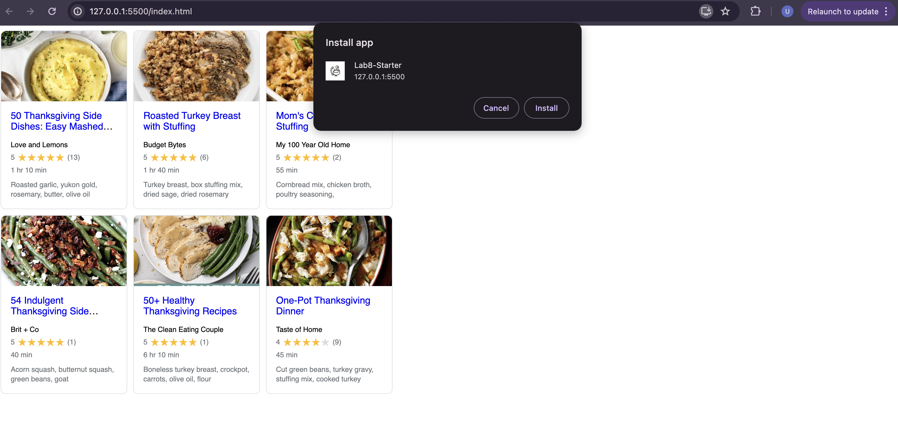

# Lab8-Starter
Graceful degration is the concept where an applicationstart with max technology and hopefully address lower levels with grace. They are related because service workers provide an offline feature and background synchronzation. This maintains the app's functionality in worse conditons. The way service workers help app ensure your application continue to function smoothly under bad network connections or when particular features are unavaliable.

https://ulises0516.github.io/Lab8-Starter/

